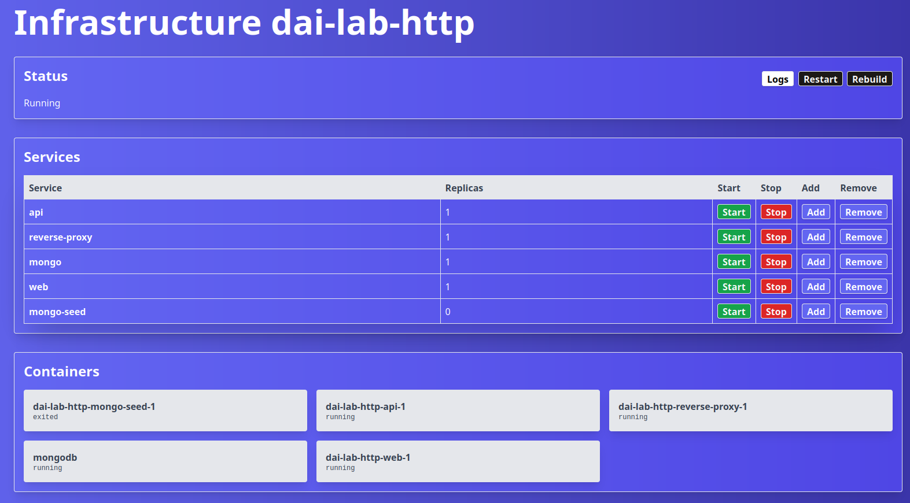

# dai-lab-http-infrastructure

The following project is a full stack application that implements a static website about blogs, a management UI and
simple RESTful API that allows to create, read, update and delete blog posts and associated comments. It is written in
Java using the [Javalin](https://javalin.io/) framework.

## Static Website

A static website that displays the content of the API is provided with the project. The sources files are located in the
[frontend](./frontend) directory. The website uses Nginx to serve the files.

See at [frontend](./frontend/README.md) for the configurations and tests of the static website.

## Docker compose

The project uses docker-compose to deploy the different components based on their respective Dockerfiles.
The stack is named `dai-lab-http`. The [docker-compose](./docker-compose.yaml) can be found at the root of the project.
The whole stack can be started with the following command:

```bash
docker compose up -d
```

It is then possible to test the connectivity to the newly created containers using e.g.
the `curl -Ik https://static.traefik.me` command
which should output something similar to this:

```http request
HTTP/2 200
accept-ranges: bytes
content-type: text/html
date: Wed, 17 Jan 2024 21:25:32 GMT
etag: "65a83430-1ce"
last-modified: Wed, 17 Jan 2024 20:10:24 GMT
server: nginx/1.25.3
content-length: 462
```

The following services are defined in the Docker compose stack:

- `web`: the static website. Runs on port 80. Accessible at [static.traefik.me](https://static.traefik.me)
- `mongo`: the MongoDB database. Runs on port 27017. Not accessible from the outside.
- `mongo-seed`: a service that seeds the database with some initial data found in the [db](./db) directory. One-shot
  container.
- `api`: the RESTful API. Runs on port 7000. Accessible at [api.traefik.me](https://api.traefik.me)
- `reverse-proxy`: the reverse proxy. Runs on port 8080. Accessible at [traefik.traefik.me](https://traefik.traefik.me).
- `reverse-proxy-https-helper`: a service that download a certificate for the reverse proxy. One-shot container.
- `management-ui`: the management UI. Runs on port 7001. Accessible at [mgmt.traefik.me](https://mgmt.traefik.me).

To stop the stack, use the following command:

```bash
docker compose down
```

To rebuild the stack, use the following command:

```bash
docker compose up -d --build
```

## Blogs API

The API is a simple RESTful service that allows to create, read, update and delete blog posts and associated comments.
It is written in Java using the [Javalin](https://javalin.io/) framework and uses a [MongoDB](https://www.mongodb.com/)
database.

The API supports the following operations:

- `GET /api/blogs`: retrieve all blogs.
- `GET /api/blogs/{id}`: retrieve a blog by its ID.
- `POST /api/blogs`: create a new blog.
- `PATCH /api/blogs/{id}`: update a blog by its ID.
- `DELETE /api/blogs/{id}`: delete a blog by its ID.
- `GET /api/blogs/{id}/comments`: retrieve all comments on a blog.
- `GET /api/blogs/{id}/comments/{id}`: retrieve a comment on a blog by its ID.
- `POST /api/blogs/{id}/comments`: create a new comment on a blog.
- `PATCH /api/blogs/{id}/comments/{id}`: update a comment on a blog by its ID.
- `DELETE /api/blogs/{id}/comments/{id}`: delete a comment on a blog by its ID.

The API depends on a MongoDB database to store the application data. Some environment variables are also required to be
set in the `.env` file in order to connect to the database.

The API is unit tested using JUnit and Mockito. The tests are located in the [./api/src/test](./api/src/test) directory.

See the [API documentation](./api/README.md) for a detailed description of the API.

## Environment variables

The following environment variables are required to run the project:

- `MONGO_INITDB_ROOT_USERNAME`: the username of the MongoDB root user.
- `MONGO_INITDB_ROOT_PASSWORD`: the password of the MongoDB root user.
- `MONGO_INITDB_DATABASE`: the name of the database to use.
- `MONGO_INITDB_ROOT_HOST`: the host of the MongoDB database.
- `DATABASE_URI`: the URI of the MongoDB database.
- `COMPOSE_NAME`: the name of the docker compose infrastructure.
- `COMPOSE_SERVICES`: the services that may be managed by the UI.
- `COMPOSE_MAX_SCALE`: the maximum scale of the services of the infrastructure.
- `API_URL`: the public URL of the API.

An [example](.env.example) `.env` file is provided with default values for the project.

## Docker compose

The project uses docker-compose to deploy the different components based on their respective Dockerfiles.
The stack is named `dai-lab-http`. The [docker-compose](./docker-compose.yaml) file is located at the root of the
project.

The following services are defined (the URLs are assuming that the Traefik reverse proxy is used):

- `web`: the static website. Runs on port 80. Accessible at [static.traefik.me](https://static.traefik.me).
- `mongo`: the MongoDB database. Runs on port 27017.
- `mongo-seed`: a service that seeds the database with some initial data found in the [db](./db) directory.
- `api`: the RESTful API. Runs on port 7000. Accessible at [api.traefik.me/api](https://api.traefik.me/api)
- `traefik`: the reverse proxy. Runs on port 8080. Accessible at [traefik.traefik.me](https://traefik.traefik.me).

To run the project while rebuilding the images, use this command:

```shell
docker compose up -d --build
```

To stop the stack, use the following command:

```shell
docker compose down
```

## Traefik

Traefik is used as a reverse proxy for the project. The configuration is the following:

- The static website is attainable at the [static.traefik.me](https://static.traefik.me) URL.
- The API server is attainable at the [api.traefik.me/api](https://static.traefik.me/api) URL.

Furthermore, the Traefik dashboard is available at [traefik.traefik.me](https://traefik.traefik.me).

Once Traefik is set up, you can start the docker compose stack using `docker compose up -d`. You should then be able to
use `docker compose ps` to see the running containers. It should output something similar to this:

```text
NAME                           IMAGE                        COMMAND                                   SERVICE         CREATED             STATUS             PORTS
dai-lab-http-api-1             dai-lab-http-api             "/bin/sh -c 'java -jar /app/app.jar'"     api             About an hour ago   Up About an hour   7000/tcp
dai-lab-http-reverse-proxy-1   traefik:v2.11                "/entrypoint.sh traefik"                  reverse-proxy   About an hour ago   Up About an hour   0.0.0.0:80->80/tcp, :::80->80/tcp, 0.0.0.0:443->443/tcp, :::443->443/tcp
dai-lab-http-web-1             dai-lab-http-web             "/entrypoint.sh nginx -g 'daemon off;'"   web             About an hour ago   Up About an hour   80/tcp
(...redacted)
```

Further documentation about reverse proxies can be found in the [related README file](./reverse-proxy/README.md).

## Scalability and load-balancing

The application is set up to use 3 instances of the `api` and `web` services using the `replicas` attribute in
the [docker-compose](./docker-compose.yaml) configuration.

Instances can be dynamically added or removed using the `docker compose up -d --scale <instance_name>=<count>` command.

> When using the `--scale` option with docker compose, make sure to specify **all** the services that must be scaled,
> otherwise compose will forget about the scale of previous services.
> Example: `docker compose up -d --scale web=2 --scale api=2`.

Traefik's logs are activated, and it is hence possible to see the load balancing in action by checking the logs of the
container using `docker compose logs reverse-proxy`.

Further information about scalability and load balancing may be found in the
related [documentation](./reverse-proxy/README.md).

## Round-robin and sticky sessions

Round-robin is a load-balancing strategy that distributes the charge of a service equally between all available
instances. Sticky sessions allow a client to always communicate with the same container. Both are implemented using
Traefik in the docker-compose file.

See at [round-robin and sticky session](./doc/round-robin_sticky-session.md) how to configure it.

## Securing Traefik with HTTPS

[Traefik.me](https://traefik.me) allows to have a valid certificate on a LAN network without the need of generating one.
The dns server of traefik.me resolve all request to *.traefik.me to 127.0.0.1. If you want another to resolve to another
IP address, you need to add it to the url like this 10.0.0.1.traefik.me.

See [https-with-traefik.me](./doc/https-with-traefik.me.md) for detailed deployment instructions.

## Management UI

The project comes with a homemade management UI. The UI allows to restart and rebuild the infrastructure, start, stop
and scale containers. It also displays container logs using a WebSocket.

The UI is set to be accessible on the `mgmt` subdomain by default. The containers that need to be managed must be
allow-listed in the .env file.

> ⚠️ This project may contain vulnerabilities. Docker is a privileged process and it's exploitation could result in bad
> things happening to your machine. **Use it at your own risk**.

More information about the use and configuration of management UI can be found in its
own [README](./management-ui/README.md).

## Showcase

Some screenshots of the project are provided below.

### Static website


### Traefik UI


### Management UI



